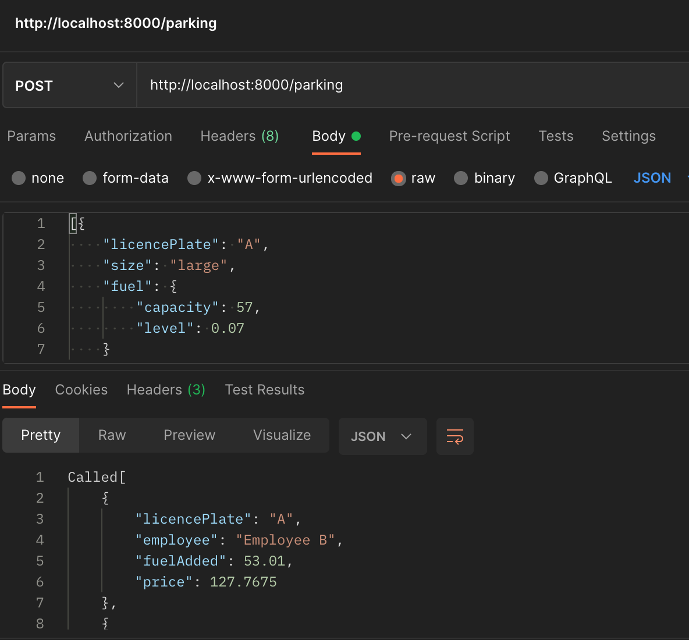

# golang-parking
parking service system api written in Golang

## Installation

With a proper golang setup type `go mod init`

## Running the api

Then run by typing `go run main.go`
Via postman type in API `http://localhost:8000/parking` and select method `POST`

## API usage

### Parking payload array

| name  | type  | optional  |     |
|---|---|---|---|
| licencePlate  | string  | no     
| size  | string  | no  |   |   
| fuel  | object  | no  |   |   

### Technologies used
- golang
- gorilla mux
